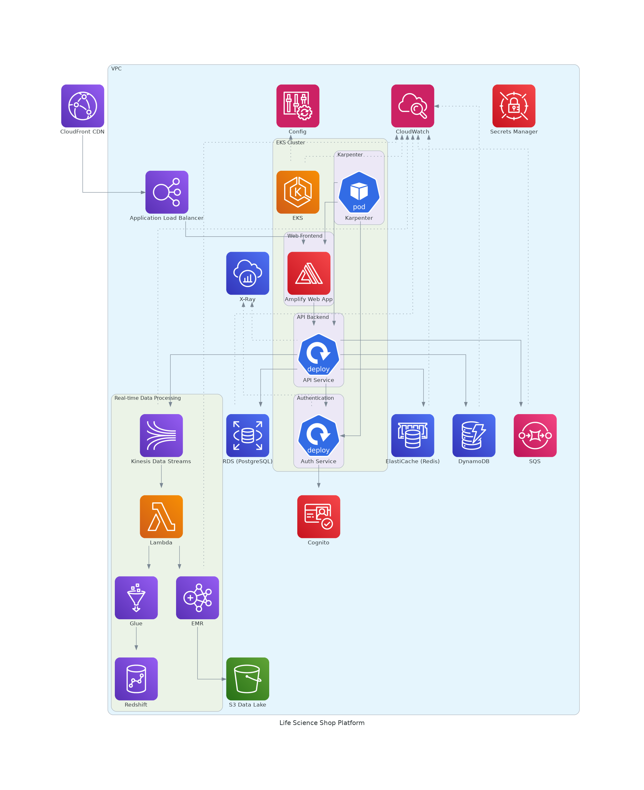

# E-Commerce Platform Architecture

## Overview

High-level architecture of scalable, highly available, and secure e-commerce platform, unsing AWS services. 
Includes: front end, RESTful API backend, database, authentication service, and real-time data processing and analytics.

## Components

# E-Commerce Platform Architecture

## Overview

This architecture uses AWS services to build a scalable, highly available, and secure e-commerce platform.

## Component Choices - why we chosed them

* **CloudFront:** Global content delivery and handling traffic spikes.
* **Application Load Balancer (ALB):** Distribute traffic evenly across EKS pods.
* **EKS with Karpenter:** Scalable and manageable container orchestration with efficient node auto-scaling.
* **Amplify:** Rapid deployment and hosting of the web application.
* **RDS (PostgreSQL):** Reliable and scalable relational database with read replicas for performance.
* **ElastiCache (Redis):** Caching layer for improved API response times.
* **DynamoDB:** Flexible NoSQL database for specific data needs (e.g., sessions).
* **Custom Authentication Service (on EKS) + Cognito:**  Customizable authentication logic with managed user management.
* **Secrets Manager:** Secure storage of sensitive application secrets.
* **Kinesis Data Streams:** Real-time data ingestion from various sources.
* **Lambda:** Serverless processing of data streams for efficiency.
* **EMR:** Big data processing and analysis for insights and reporting.
* **Glue:** Simplified ETL processes for data transformation.
* **Redshift:** Data warehousing for complex queries and business intelligence.
* **S3:** Cost-effective data lake for storing processed and historical data.
* **SQS:** Decoupling components and handling asynchronous tasks.
* **CloudWatch:** Monitoring and observability for application health and performance.
* **X-Ray:** Distributed tracing for identifying and troubleshooting performance bottlenecks.
* **Config:** Continuous monitoring and enforcement of infrastructure configuration rules.

## Key Features

* **Scalability:**  EKS, Karpenter, CloudFront, and ALB ensure the platform scales to handle varying workloads.
* **Availability:** Multi-AZ database deployments and CloudFront enhance platform uptime.
* **Security:** Cognito, IAM roles, encryption (at rest and in transit) secure the platform and data. 

## License

This architecture made for demonstration purposes, may not be intended for production use. 
